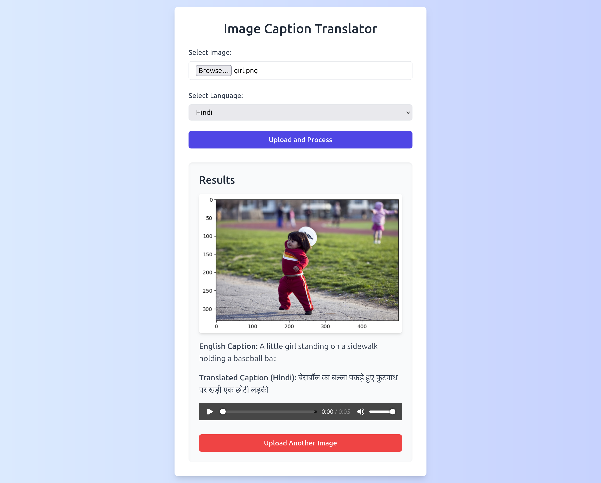
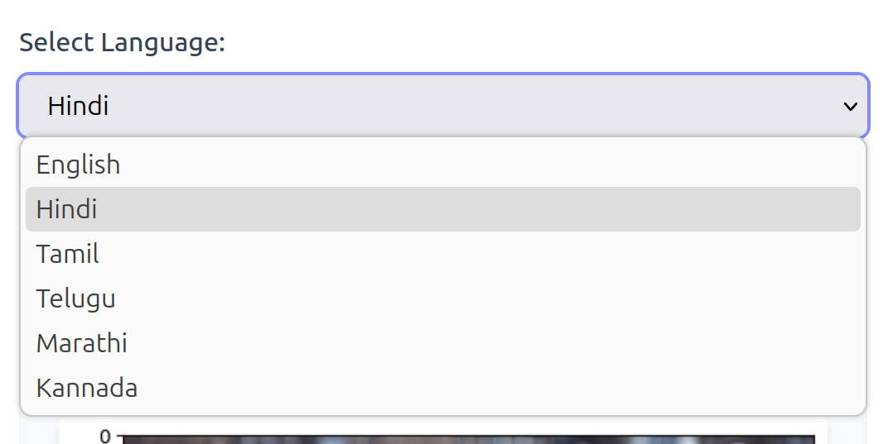

# DS510 : Artificial Intelligence and Machine Learning Lab
## Mini Project - 02

This project is a Flask-based web application that allows users to upload images, generate captions for those images, translate the captions into various languages, and create audio narrations of the translated captions.

The application uses a pre-trained VisionEncoderDecoderModel to generate captions for uploaded images and the IndicTrans2 model to translate the captions into multiple languages. The audio narrations are generated using Google Text-to-Speech (gTTS).



## Features

- **Image Upload**: Users can upload images in `png`, `jpg`, or `jpeg` formats.
- **Caption Generation**: Automatically generate captions for uploaded images using a pre-trained VisionEncoderDecoderModel.
- **Translation**: Translate the generated captions into multiple languages using the IndicTrans2 model.
- **Audio Narration**: Generate audio narrations of the translated captions using Google Text-to-Speech (gTTS).

## Installation

1. Clone the repository:
    ```sh
    git clone https://github.com/nagajas/DS510-MiniProject2.git
    cd DS510-MiniProject2
    ```

2. Create and activate a virtual environment:
    ```sh
    python3 -m venv venv
    source venv/bin/activate
    ```

3. Clone the IndicTransToolkit for Machine Translation
    ```sh
    cd backend
    git clone https://github.com/VarunGumma/IndicTransToolkit
    python3 -m pip install --editable ./IndicTransToolkit/
    ```

4. Install the required dependencies:
    ```sh
    pip install -r requirements.txt
    ```

## Usage

To run the **DS510 Mini Project 02** application locally, follow the steps below to set up and start both the backend and frontend components.

### 1. Start the Backend

```sh
cd backend
python app.py
```

### 2. Start the Frontend
Run the following in a new terminal window to start the frontend server:
```sh
cd frontend
npm install
npm start
```

### 3. Access the Web UI at `http://localhost:3000`
Use the web UI to upload an image, select a target language, and generate the caption, translation, and audio narration.

## Configuration

- **UPLOAD_FOLDER**: Directory where uploaded files are stored. Default is `static/uploads`.
- **MAX_CONTENT_LENGTH**: Maximum allowed size for uploaded files. Default is `16MB`.

## Supported Languages

The application supports the following languages for translation and audio narration:

- English
- Hindi
- Tamil
- Telugu
- Marathi
- Kannada



You can select the target language from the dropdown menu on the web UI.

## File Structure

```
DS510-MiniProject2/
├── backend/
│   ├── app.py
│   ├── requirements.txt
│   ├── static/
│   │   └── uploads/
│   └── README.md
├── frontend/
│   ├── public/
│   │   ├── index.html
│   │   └── manifest.json
│   ├── src/
│   │   ├── App.js
│   │   ├── App.css
│   │   ├── index.js
│   │   ├── index.css
│   │   ├── tailwind.config.js
│   │   └── postcss.config.js
│   ├── package.json
│   ├── package-lock.json
│   ├── tailwind.config.js
│   ├── postcss.config.js
│   └── README.md
├── LICENSE
└── README.md
```

## Dependencies

- Flask
- Flask-Cors
- OpenCV
- Torch
- Transformers
- gTTS
- PIL
- IndicTransToolkit

## License

This project is licensed under the MIT License. See the [LICENSE](LICENSE) file for details.

## Acknowledgements

- [Hugging Face](https://huggingface.co/) for the pre-trained models.
- [Google Text-to-Speech](https://pypi.org/project/gTTS/) for audio narration.
- [OpenCV](https://opencv.org/) for image processing.
